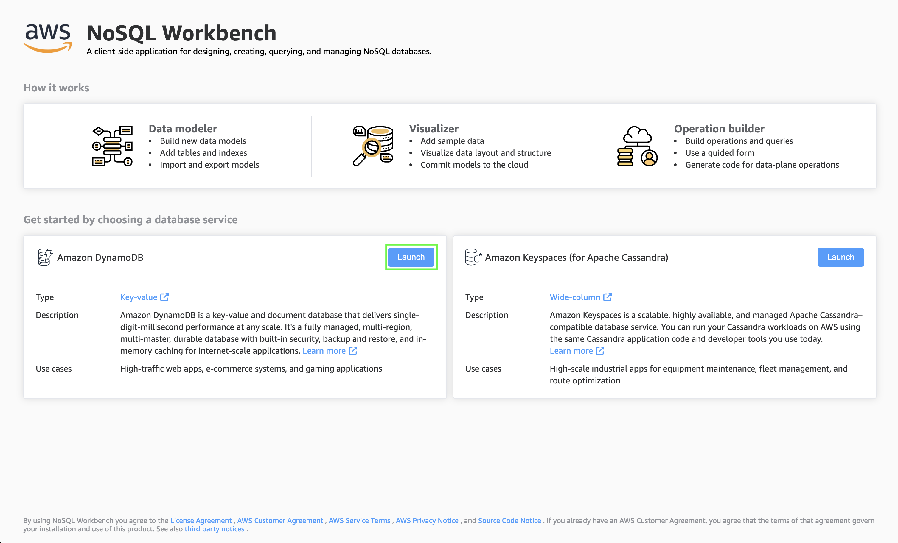
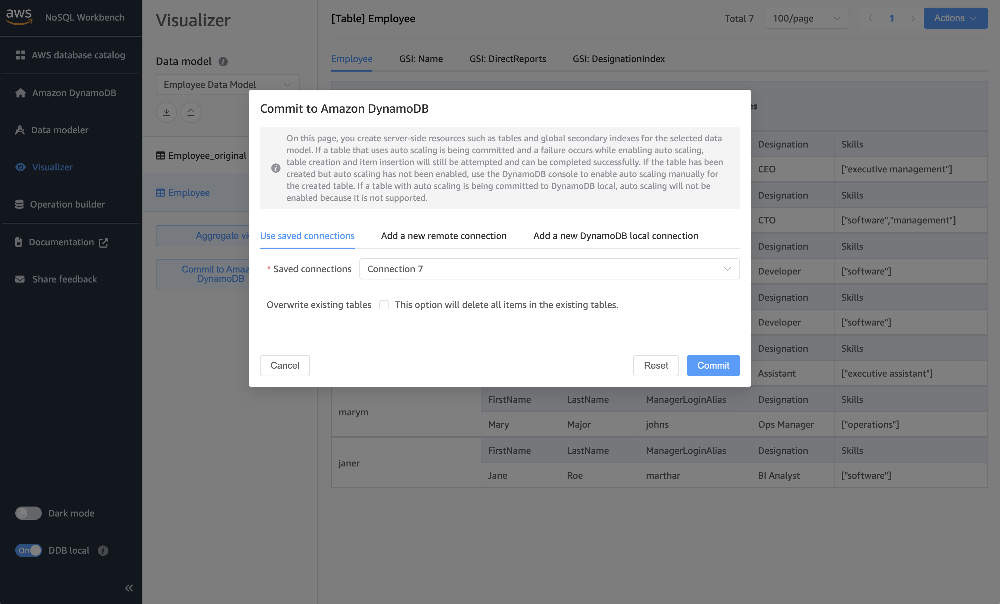

# 3. NoSQL Workbench for DynamoDB

## Setting up the Employee Table in DynamoDB

The following steps will guide you in setting up the Employee table in DynamoDB web-service or DynamoDB Local. This setup will assist you as you navigate through chapters in the book, demonstrating concepts using the Employee data model. The NoSQL Workbench tool will be utilized to establish the model.

NoSQL Workbench for DynamoDB comes with the Employee data model as a template. We will use that in-built template.

### Importing the Employee Data Model in Amazon DynamoDB Using NoSQL Workbench

1. **Open NoSQL Workbench:**
   Launch NoSQL Workbench on your local machine. On the workbench landing page, select **Launch** next to **Amazon DynamoDB**.

   

2. **Create a New Model from Templates:**
   In NoSQL Workbench, select **Create new data model**. Choose **Start from a template** from the options. Find and select the *Employee Data Model* template.
   
   

   You may keep the default configurations, which will create the Employee data model with sample data. Name this model in your NoSQL Workbench. This name will not affect the DynamoDB table or sample data.
   
   

3. **Connect to DynamoDB:**
   Use the **Operation builder** subtool to create a NoSQL Workbench connection. In the navigation panel on the left, select **Add connection**. Choose either the **Remote** option (for DynamoDB on AWS Cloud) or **DynamoDB local** (for client-side use, avoiding AWS Cloud costs). Enter the necessary credentials. For DynamoDB Local, you only need to provide the hostname and port, not credentials. Once entered, click **Connect**.
   
   

4. **Review and Confirm:**
   Go to the **Visualizer** subtool, select the *Employee Data Model* from the dropdown, and click **Aggregate view** to load the model with its sample data. 

   

> Follow steps 5 and 6 only if you want to import the model with sample data into DynamoDB local or the Amazon DynamoDB web service.

5. **(Optional) Create Table and Load Data into DynamoDB Local or Web Service:**
 Select **Commit to Amazon DynamoDB** to create the table and load sample data into DynamoDB Local or the web service. Choose the connection you created in step 3 from the dropdown. Finally, click **Commit**. If the table already exists, check **Overwrite existing tables** to delete all items in the existing table before loading from the workbench.
   
   

6. **Verify Data Model:**
    Go to your DynamoDB destination (Remote or Local) and verify that the Employee table has been created with the sample data.

