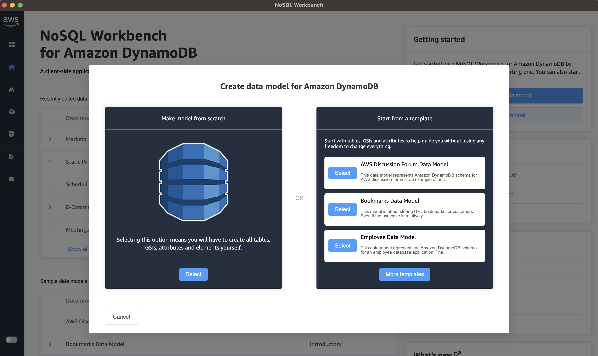
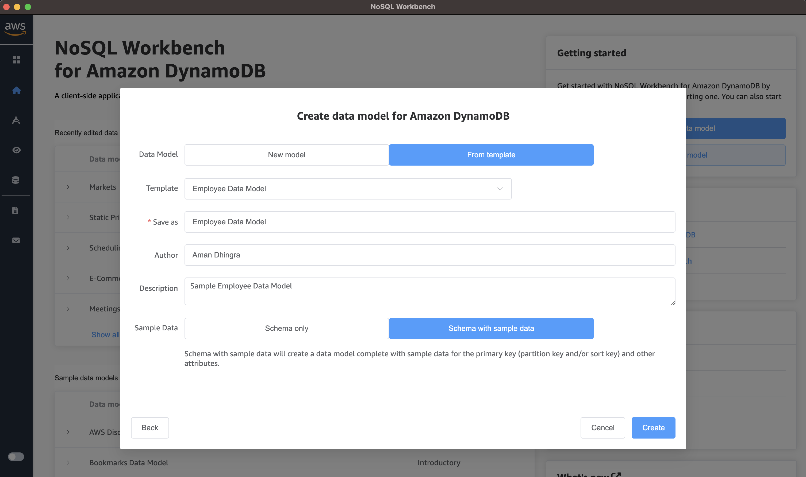
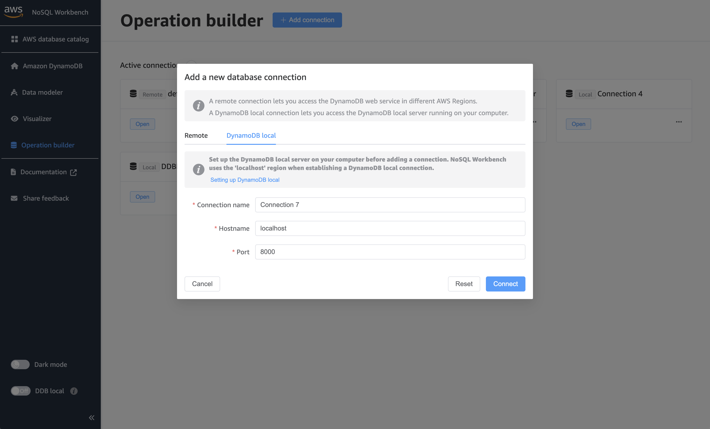
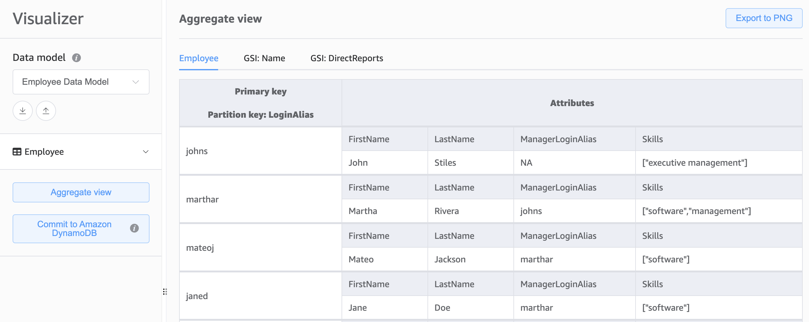

## Setting up the Employee Table in DynamoDB

The following steps will guide you in setting up the Employee table in DynamoDB web-service or DynamoDB Local. This setup will assist you as you navigate through chapters in the book, demonstrating concepts using the Employee data model. The NoSQL Workbench tool will be utilized to establish the model.

### Importing the Employee Data Model in Amazon DynamoDB using NoSQL Workbench

1. **Open NoSQL Workbench:**
   Launch the NoSQL Workbench for Amazon DynamoDB on your computer.

2. **Create a New Model from templates:**
   In the NoSQL Workbench, select **Create new data model**. In the options of creating a new model, select **Start from a template**. Within the template list, look for the *Employee Data Model*, select that.
   
   

   You may leave the default configurations as is, which will create the Employee data model with sample data. Give this model a name in your NoSQL Workbench. This name will have no impact on the DynamoDB table and sample data.
   
   

3. **Connect with DynamoDB:**
   Create a NoSQL Workbench connection through the **Operation Builder** subtool via the navigation panel on the left hand side. Select Add connection once on the Operation Builder subtool page. Depending on your preference, you may choose the **Remote** option (as in the DynamoDB web-service on AWS Cloud) or the **DynamoDB Local** option (local, client-side, not incurring costs on the AWS Cloud). Add the credential information appropriately. Note that for the DynamoDB Local, you only need to provide the hostname and port, and not the credentials. Once all the information is entered, hit **Connect**.
   
   

4. **Review and Confirm:**
   Next, head to the **Visualizer** subtool, and select the *Employee Data Model* from the drop down. You may hit Aggregate View to load up the model with its sample data but it is not mandatory. Next, hit the Commit to Amazon DynamoDB option. You may be asked to choose a database connection in a drop down, choose the connection you created in step 3. Finally, hit commit.
   
   

5. **Verify Data Model:**
    You may head to the appropriate DynamoDB destination (Remote or DynamoDBLocal) and verify that the Employee table has been created with sample data.

