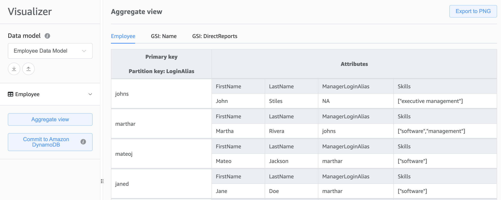

# 4. Simple Key-Value

## What is Key-Value?

### Example database operations of the key-value kind

- [Employee data model for reference](#employee-data-model-for-reference)
- [`GetItem` example using the AWS CLI](#getitem-example-using-the-aws-cli)
- [`GetItem` example using the AWS SDK for Python (Boto3)](#getitem-example-using-the-aws-sdk-for-python-boto3)
- [`ExecuteStatement` example using the AWS SDK for Python (Boto3)](#executestatement-example-using-the-aws-sdk-for-python-boto3)
- [`PutItem` example using the AWS CLI](#putitem-example-using-the-aws-cli)
- [`PutItem` example using the AWS SDK for Python (Boto3)](#putitem-example-using-the-aws-sdk-for-python-boto3)
- [Reserved keywords example using the AWS SDK for Python (Boto3)](#reserved-keywords-example-using-the-aws-sdk-for-python-boto3)

#### Exmployee data model for reference




#### `GetItem` example using the AWS CLI
```shell
aws dynamodb get-item \
    --table-name "Employee" \
    --key '{"LoginAlias":{"S":"janed"}}' \
    --endpoint "https://dynamodb.eu-west-2.amazonaws.com" \
    --region "eu-west-2"
```

#### `GetItem` example using the AWS SDK for Python (Boto3)

```python
import boto3

# Initialize a DynamoDB client for the specified region
client = boto3.client('dynamodb', region_name='eu-west-2')

# Define the parameters for the GetItem request
params = {
    'TableName': 'Employee',
    'Key': {
        'LoginAlias': {'S': 'janed'}
    }
}

# Retrieve the item from DynamoDB using the specified parameters
response = client.get_item(**params)

# Print the retrieved item
print(response['Item'])
```

#### `ExecuteStatement` example using the AWS SDK for Python (Boto3)
```python
import boto3

# Initialize a DynamoDB client for the specified region
client = boto3.client('dynamodb', region_name='eu-west-2')

# Define the parameters for the ExecuteStatement request
params = {
    'Statement': 'SELECT * FROM Employee WHERE LoginAlias = \'janed\''
}

# Execute the statement to query the DynamoDB table
response = client.execute_statement(**params)

# Print the retrieved items
print(response['Items'])
```

#### `PutItem` example using the AWS CLI
```shell
# If you do not have the `definitive-guide` profile created in your local machine,
# you can skip --profile defintive-guide AND remove the forward slash after eu-west-2
aws dynamodb put-item \
    --table-name Employee \
    --item '{
        "LoginAlias": {"S": "amdhing"},
        "Designation": {"S": "Architect"},
        "FirstName": {"S": "Aman"},
        "LastName": {"S": "Dhingra"},
        "ManagerLoginAlias": {"S": "marthar"},
        "Skills": {"SS": ["software"]}
    }' \
    --region eu-west-2 \
    --profile definitive-guide 
```

#### `PutItem` example using the AWS SDK for Python (Boto3)
```python
import boto3

# Initialize a DynamoDB client for the specified region
client = boto3.client('dynamodb', region_name='eu-west-2')

# Define the parameters for the PutItem request
params = {
    'TableName': 'Employee',
    'Item': {
        'LoginAlias': {'S': 'ripani'},
        'ManagerLoginAlias': {'S': 'marthar'},
        'FirstName': {'S': 'Lorenzo'},
        'LastName': {'S': 'Ripani'},
        'Designation': {'S': 'Developer'},
        'Skills': {'SS': ['software']}
    }
}

# Execute the PutItem request
response = client.put_item(**params)

# Print the response from DynamoDB
print(response)
```

#### [Reserved keywords](https://docs.aws.amazon.com/amazondynamodb/latest/developerguide/ReservedWords.html) example using the AWS SDK for Python (Boto3)
```python
# Partial code snippet with request parameters only
dynamodb.query(
    "TableName" = "sample-table",
    "KeyConditionExpression" = "#year_placeholder = :year_value",
    "ExpressionAttributeNames" = {
        "#year_placeholder": "year"
    },
    "ExpressionAttributeValues" = {
        ":year_value": {"N": 2022}
    }
) 
```